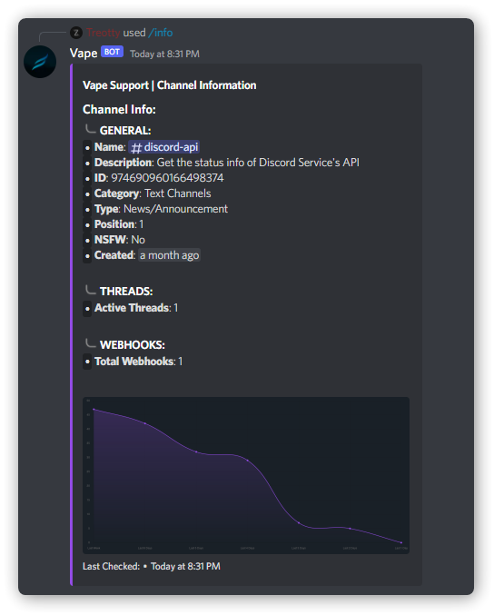
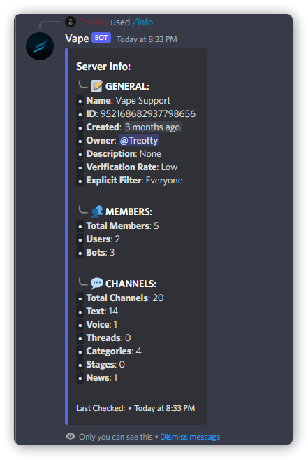
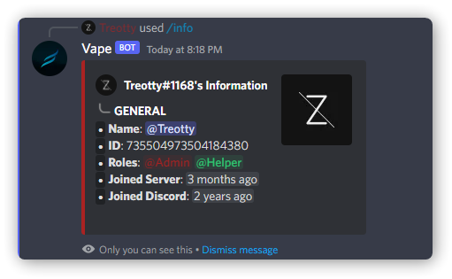
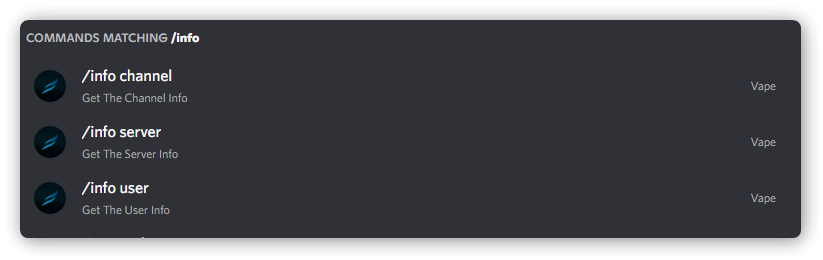

# ** Multi Guild Info Command**

An Info command for Discord.js bots
<br/>
<br/>

## ** Preview**

<br/>
<div display="flex" justify-content="center">
    
    
    
    
</div>
<br/>
<br/>

## ** Packages**
<br/>

```bash
npm i discord.js chartjs-node-canvas chart.js chartjs-plugin-gradient moment ms
```
